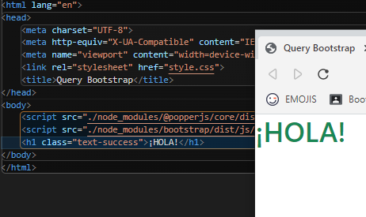
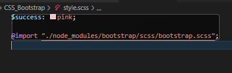
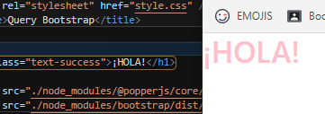

Vamos a cambiar las propiedades, en este caso de los colores, de Bootstrap.

----

1. Asociamos BootStrap desde NPM
    Dentro del terminal: 

   **npm init -v**

   **npm install bootstrap**

----
2. Creamos fichero style.scss en el que importamos hacía el fichero bootstrap.scss:

**@import "./node_modules/bootstrap/scss/bootstrap.scss";**

Compilamos SCSS

----

3. Al final del body añadiremos los Scripts:

 **<sript src="./node_modules/@popperjs/core/dist/umd/popper-base.min.js"></sript>**
  ****

----
  
  El color de bootstrap "success" es verde:
  

Modificamos en style.scss:

Y podremos ver como se ha modificado el color!

Para poder crear un color: 

Modificamos el scss:

